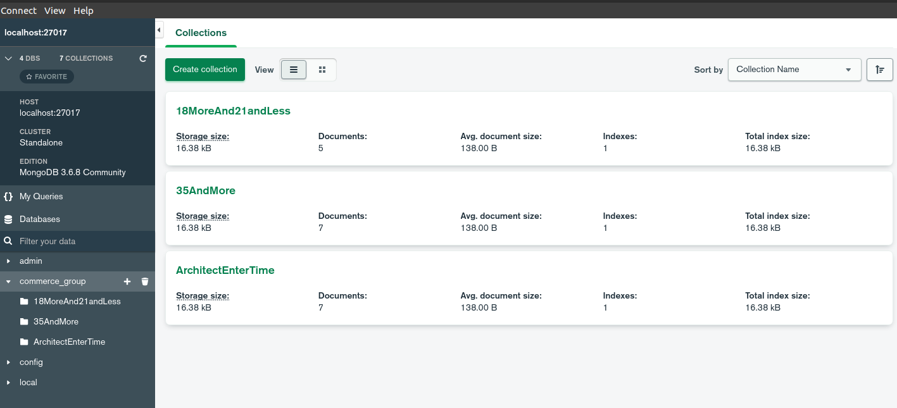
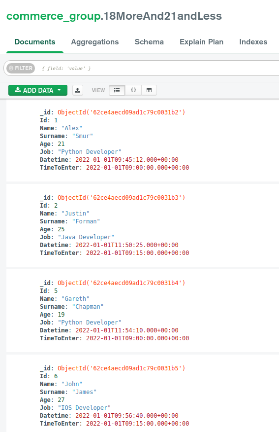
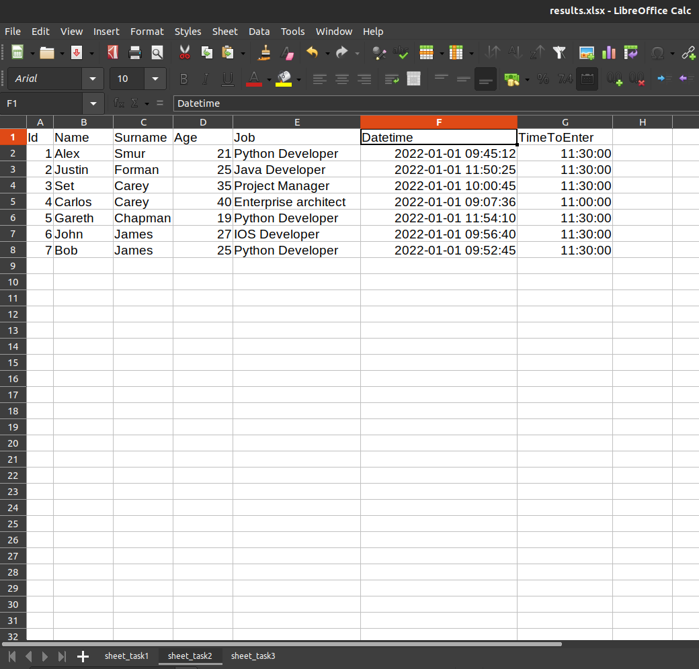

# commerce_group_test_task

### 1. MongoDB Compass, все 3 коллекции

### 2. Пример первой коллекции

### 3. Пример Excel таблицы. Данные для разных коллекции в отдельных листах(Sheets).
### Excel serial number to Datetime сделал с помощью Format->Cells->Date/Time.
